# 🏟️Stardium

Stardium is an AI-powered commander designed for elite sporting events. It leverages the Google Cloud Ecosystem to provide real-time telemetry, authoritative AI redirects and secure fan engagement.

📄 Google Cloud Run Link - https://stardium-service-805504669798.us-central1.run.app

## 🌌 Quick Glance
<p align="center">
  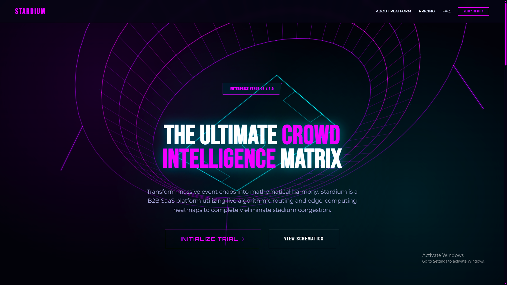<br>
  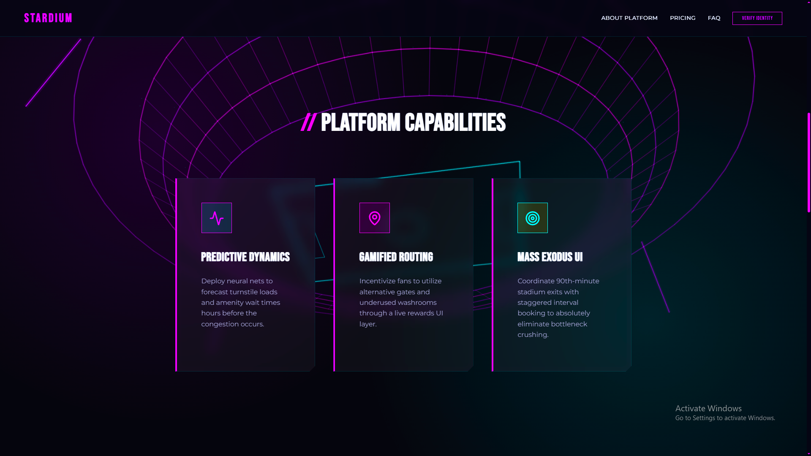<br>
  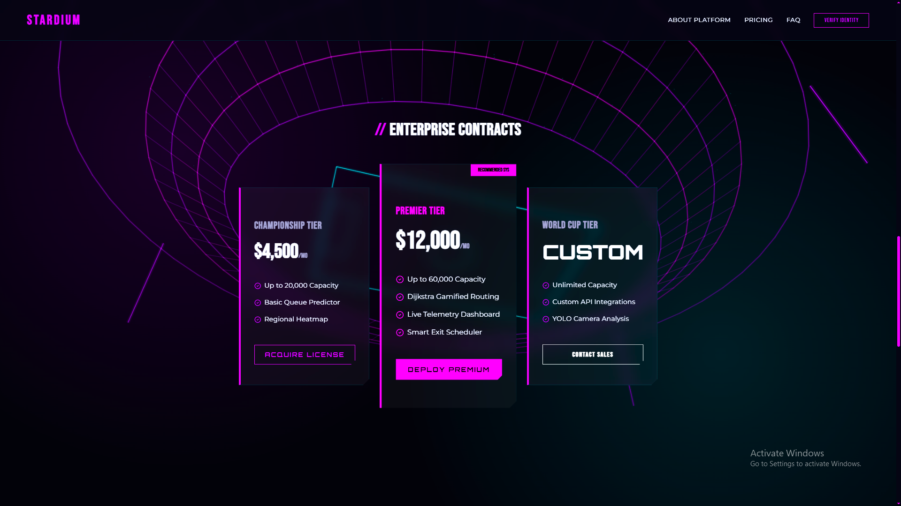<br>
  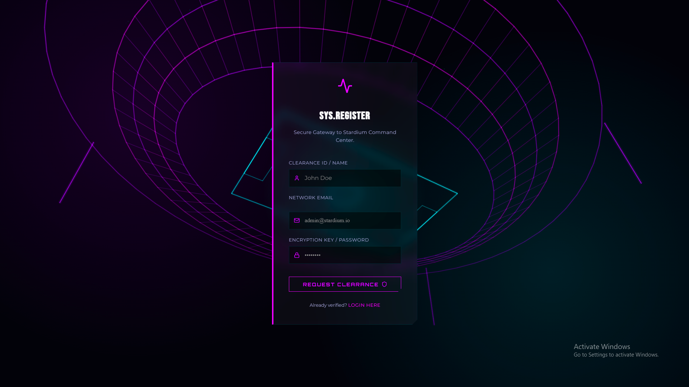<br>
  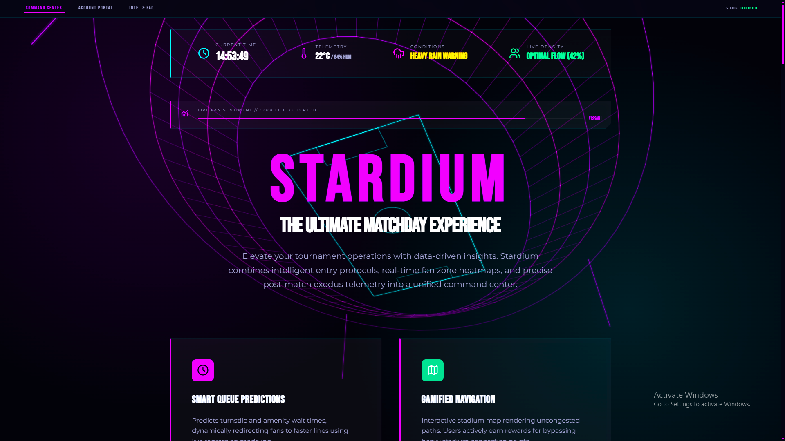<br>
  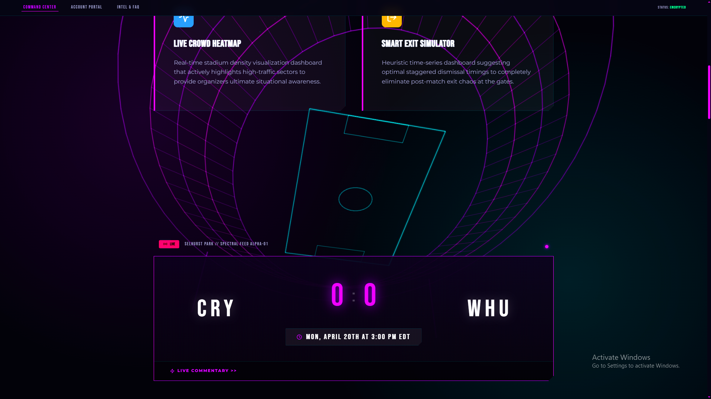<br>
  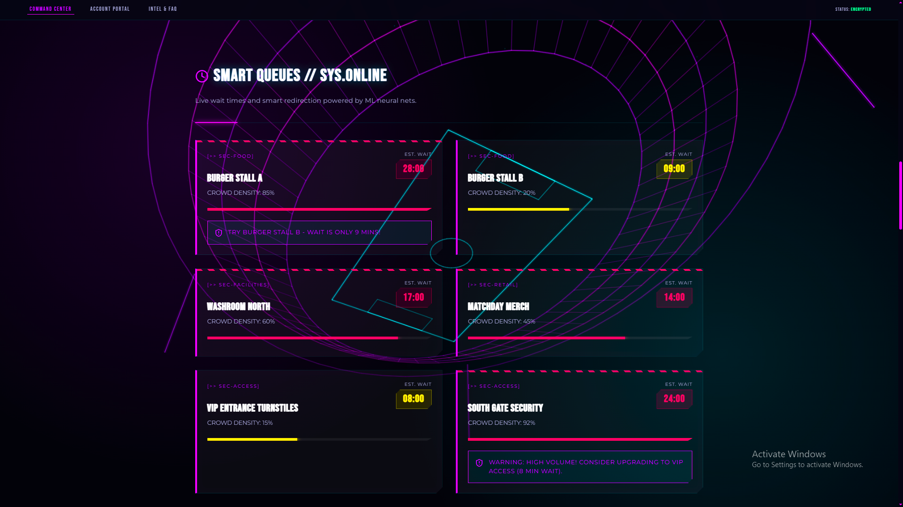<br>
  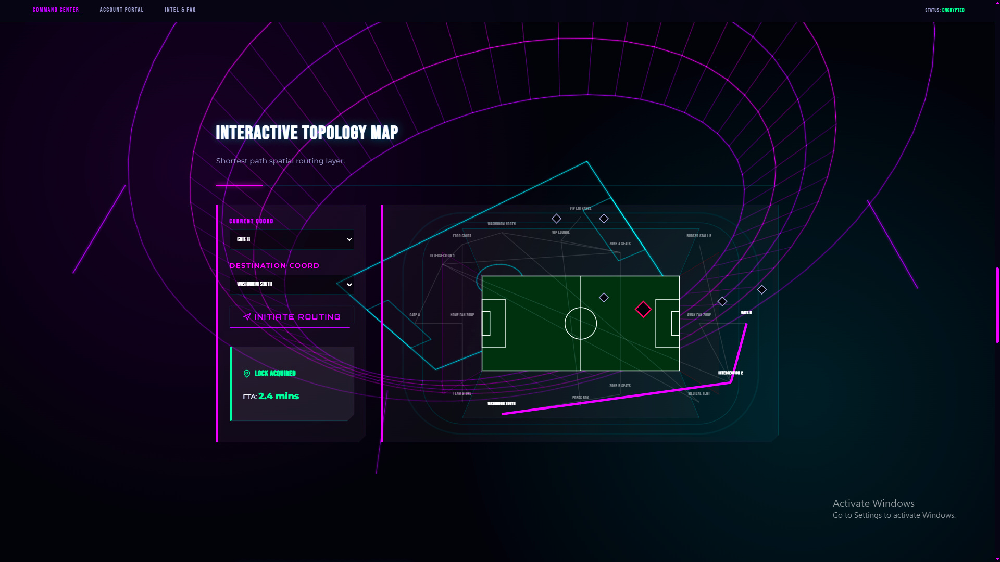<br>
  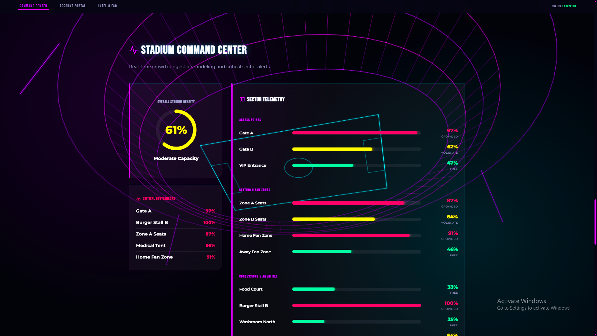<br>
  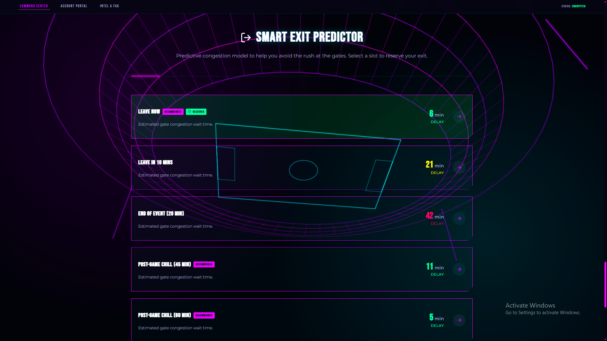<br>
  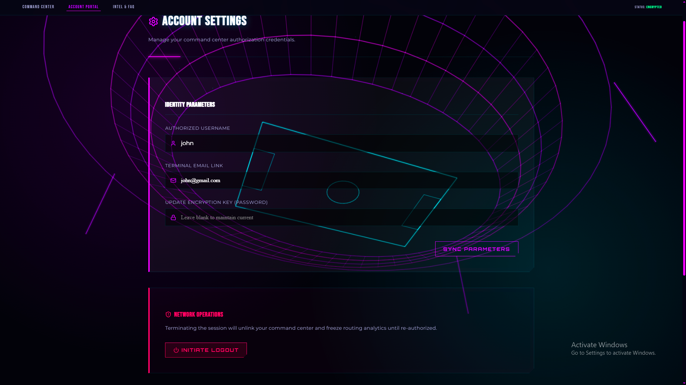<br>
  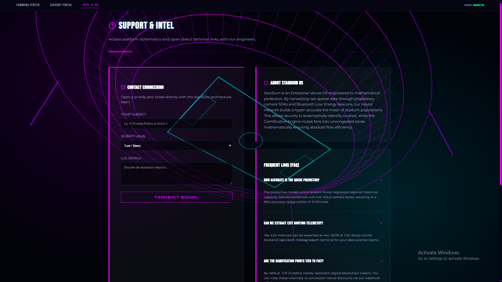<br>
</p>

## 🌌 Advanced Google Cloud Integration
Stardium demonstrates deep adoption across the Google Ecosystem -
- **🤖 Google Gemini 1.5 Flash** - Orchestrates real-time crowd management announcements based on complex sector telemetry.
- **🔥 Firebase Realtime Database** - Powers the "Live Fan Sentiment" tracking system with sub-millisecond data synchronization.
- **🆔 Google Identity Services** - Native One Tap Auth integration providing a seamless, secure entry experience.
- **📊 Google Cloud Operations** - Integrated Cloud Logging SDK for professional backend observability and audit trails.
- **🎨 Google Material Design** - Full platform alignment using Google Fonts (Orbitron/Roboto) and Material Symbols.

## ⚡ Performance & Efficiency
- **📱 Progressive Web App (PWA)** - Full offline capability and intelligent asset caching via Service Workers.
- **⏳ Perceived Performance** - Custom Skeleton Loading architecture ensures a stable layout and high LCP scores.
- **📦 Code Splitting** - Granular lazy-loading of heavy modules (Map, Heatmap) for instant first-paints.

## 🛠️ Technical Stack
| Category | Technology |
| :--- | :--- |
| **Foundations** | React 19, Python 3.11, Vite |
| **Data & Cloud** | **Firebase RTDB**, **Google Cloud Logging**, **Gemini API** |
| **Logic** | NetworkX, NumPy, Marshmallow |
| **Security** | **Google Identity**, Talisman, Gunicorn |
| **Efficiency** | **Vite PWA**, Skeleton Loaders, React.lazy |

## ⚙️ Setup & Deployment
### 💻 Local Development
#### 1. Backend (Flask)
```bash
cd Backend
python -m venv venv
venv\Scripts\activate
pip install -r requirements.txt
python app.py
```

#### 2. Frontend (React/Vite)
```bash
cd Frontend
npm install --legacy-peer-deps 
npm run dev
```

## 🛡️ Challenges & Technical Hurdles
Building a real-time Venue OS presented several complex engineering challenges -

1.  **Dependency Conflict Resolution** - The project utilizes Vite 8 alongside legacy PWA plugins, requiring careful peer-dependency management (`--legacy-peer-deps`) to ensure a stable build environment.
2.  **Inconsistent API Telemetry** - Live match data from external providers often lacks critical labels (like "Home" vs "Away") during the "Scheduled" phase. We developed a robust heuristic parsing layer to ensure high-fidelity UI rendering regardless of API quality.
3.  **Real-Time Sync at Scale** - Synchronizing fan sentiment data from Firebase RTDB with sub-millisecond latency while maintaining low overhead on the client-side required optimized listeners and selective state updates.
4.  **UI/UX Precision** - Balancing high-intensity cyberpunk aesthetics with perfect data alignment (e.g., the scoreboard optics) required custom CSS grid architectures and monospaced font treatments.

## 🚀 Future Roadmap
- **Multi-Stadium Swarm** - Orchestrate multiple venue dashboards from a single global HQ.
- **Gemini Pro Vision** - Integrate live CCTV streams for real-time AI visual crowd counting.
- **Web3 Ticketing** - Blockchain-based digital twins for tickets to eliminate secondary market scalping.
- **AR Navigation** - Augmented Reality paths for fans via the mobile SDK.
